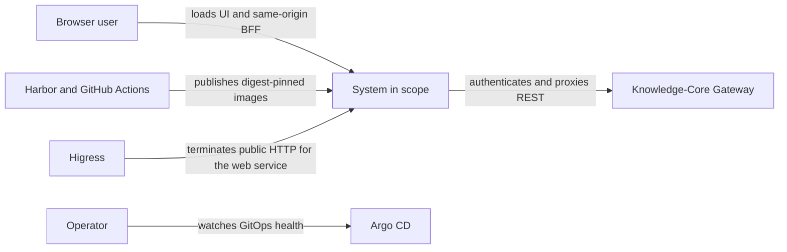
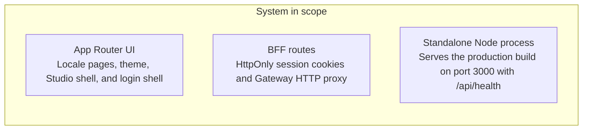

<!-- Generated by Skill Constructor. Edit .skill-constructor/manifest.json through the CLI. -->

# Knowledge-Core-Web: Architecture

Knowledge-Core-Web is the Knowledge Core product surface: a Next.js App Router UI plus a same-origin BFF. It serves home, Studio, and login shells, localizes Simplified Chinese and English, and keeps Gateway session credentials in HttpOnly cookies. It does not own PostgreSQL, Redis, NATS, object storage, or Yjs persistence; those remain in Knowledge-Core behind the Gateway.

## Scope

**In scope**

- Desktop-first public and authenticated UI shells, including locale routes for zh-CN and en
- Same-origin BFF for login, registration, session, logout, and Gateway HTTP proxy
- Process-local health at /api/health
- Standalone Node production image on port 3000 and Kustomize packaging under deploy/web
**Out of scope**

- Direct access to Identity, Knowledge, Collaboration, Attachment, or Platform
- Ownership of PostgreSQL schemas, Redis, NATS JetStream, MinIO/S3, or Yjs CRDT state
- Gateway HTTP routes, Higress routing, or cluster network policy
- Native mobile apps, old-site content migration, or claiming unobserved production or canary topologies

## Stakeholders and concerns

### Authors and small teams

- **concerns**:
  - usable writing and reading surfaces
  - sessions that stay in the browser origin
  - predictable locale and theme behavior

### Operators

- **concerns**:
  - immutable Harbor images
  - Argo-synced k3s-dev delivery
  - process health without hiding Gateway failures

### Web developers

- **concerns**:
  - one Gateway client
  - strict TypeScript and UI quality gates
  - no credential leakage into client bundles

## System context

## Containers

## Architecture principles

### BFF owns browser sessions

- **description**: Access and refresh credentials never enter client JavaScript, localStorage, or the Next.js browser bundle.

### Single Gateway client

- **description**: Server code reaches Knowledge-Core only through src/lib/api/gateway.ts and the /api/gateway proxy; pages do not scatter fetch calls.

### Fail closed at the origin

- **description**: Mutating BFF routes reject cross-origin requests. Health checks the web process only and does not pretend Gateway is healthy.

### Web does not own backend data

- **description**: Folder, document, attachment, and collaboration authority stay in Knowledge-Core services. The UI must not infer permissions.

## Key flows

### Login and session cookies

- **description**: The browser posts to /api/auth/login. The BFF calls Gateway /api/v1/sessions, then sets HttpOnly cookies kc_access and kc_refresh and returns only the user projection.

### Authenticated Gateway proxy

- **description**: The browser calls /api/gateway/*. The BFF forwards method, body, and selected tracing headers, attaching the session cookie as the Gateway Authorization header.

### Silent refresh

- **description**: A 401 from Gateway with a refresh cookie present causes the BFF to call /api/v1/sessions/refresh, rotate cookies, and retry the original request once.

### Live collaboration is not a web-owned hop

- **description**: Yjs WebSocket traffic goes browser to Collaboration after Knowledge issues a short-lived ticket. The web process does not persist CRDT updates.

## Quality attributes

### Credential confinement

- **measure**: No access or refresh credential appears outside HttpOnly cookies and server memory
- **scenario**: A page, Storybook story, or client bundle is inspected for session material

### Origin integrity

- **measure**: The route returns 403 and does not call Gateway
- **scenario**: A cross-site POST reaches a mutating BFF route

### Operability

- **measure**: /api/health answers from the Node process without requiring Gateway
- **scenario**: Kubernetes probes the web process

### Delivery safety

- **measure**: Harbor digest, Argo sync, and smoke checks pass before fast-forward to main; force-push is forbidden
- **scenario**: A candidate image is promoted

## Architecture decisions

### Same-origin BFF instead of a browser Gateway client

- **rationale**: Keeps Knowledge-Core credentials off the client and lets the UI speak stable DTOs.
- **tradeoffs**:
  - Every authenticated REST call pays a web hop
  - Cookie and CSRF/origin policy must be maintained in Route Handlers

### Gateway remains the only Knowledge-Core edge

- **rationale**: Web must not reconstruct service topology or bypass typed HTTP contracts.
- **tradeoffs**:
  - Web cannot query service databases for convenience
  - Contract changes require Knowledge-Core IDL and Gateway mapping first

### Standalone Node image on port 3000

- **rationale**: Matches Next.js production output and keeps probes process-local.
- **tradeoffs**:
  - Two replicas still share no in-process session store beyond cookies
  - Gateway availability is verified by smoke, not by /api/health

## Risks

### Docs lag the BFF

- **mitigation**: Treat docs/progress.md as historical; record only behavior present in src/app/api and deploy/web.

### Studio shells without domain APIs

- **mitigation**: Do not claim document, folder, AI, or community features until those Gateway flows are wired and tested.

### Unobserved production and canary

- **mitigation**: Keep those environment definitions unnamed beyond kind; never invent namespaces, replica counts, or digests.

<!-- fact:architecture.design status:verified sources:docs/technical-plan.md -->
