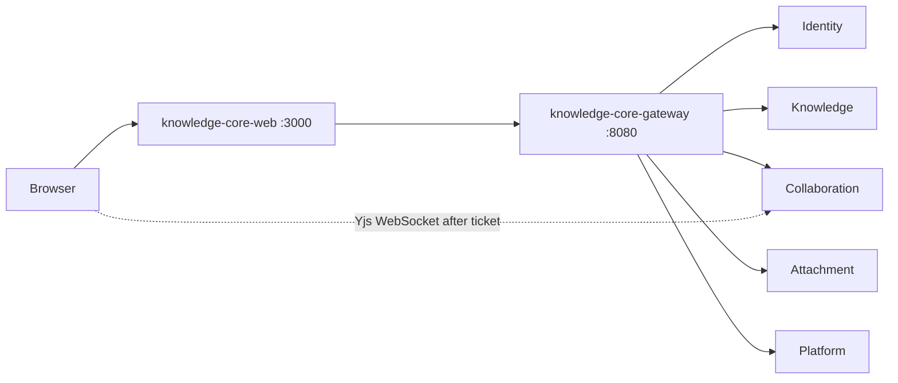

<!-- Generated by Skill Constructor. Edit .skill-constructor/manifest.json through the CLI. -->

# Knowledge-Core-Web: Services

The browser talks only to Knowledge-Core-Web on the same origin. The BFF authenticates through `/api/auth/*` and proxies Gateway HTTP through `/api/gateway/[...path]`. knowledge-core-web depends on knowledge-core-gateway and does not call Identity, Knowledge, Collaboration, Attachment, or Platform directly. Live Yjs traffic is a browser-to-Collaboration path after Knowledge issues a short-lived ticket; the web process does not persist CRDT updates.

<!-- fact:services.relationships status:verified sources:docs/technical-plan.md -->

### knowledge-core-web

- **apis**: App Router pages under /{locale}; BFF /api/auth/*, /api/gateway/[...path], /api/health
- **data**: None; no domain schema
- **dependencies**: knowledge-core-gateway
- **doesNotOwn**: PostgreSQL, Redis, NATS, MinIO/S3, Yjs persistence, Gateway routes, or cluster network policy
- **health**: /api/health
- **language**: TypeScript
- **ports**: {"http":3000}
- **role**: Next.js UI and same-origin BFF

<!-- fact:services.catalog status:verified sources:deploy/web/base/deployment.yaml, user-confirmed -->

## Appendix

## `entrypoints.catalog`

Status: `verified`

Local development is `pnpm dev`. Production serves `.next/standalone/server.js` on port 3000. Process health is `/api/health`. Deployment smoke is `scripts/smoke.sh`. Kubernetes packaging lives under `deploy/web`, with the current overlay at `deploy/web/overlay/dev`.

Sources: `user-confirmed`
