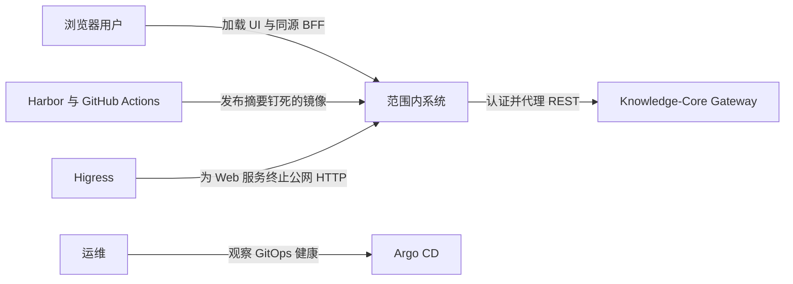
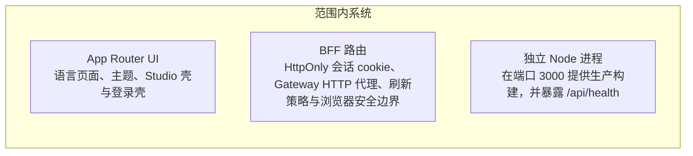

<!-- Generated by Skill Constructor. Edit .skill-constructor/manifest.json through the CLI. -->

# Knowledge-Core-Web: 架构

Knowledge-Core-Web 是 Knowledge Core 的产品表面：Next.js App Router 界面加上同源 BFF。它提供首页、Studio 与登录壳，本地化简体中文和英文，并把 Gateway 会话凭证放在 HttpOnly cookie 中。它不拥有 PostgreSQL、Redis、NATS、对象存储或 Yjs 持久化；这些仍由 Gateway 后面的 Knowledge-Core 负责。

## 范围

**范围内**

- 桌面优先的公开与已认证 UI 壳，包括 zh-CN 与 en 的语言路由
- 同源 BFF：登录、注册、会话、登出，以及 Gateway HTTP 代理
- 进程本地健康检查 `/api/health`
- 端口 3000 上的独立 Node 生产镜像，以及 `deploy/web` 下的 Kustomize 打包
**范围外**

- 直接访问 Identity、Knowledge、Collaboration、Attachment 或 Platform
- 拥有 PostgreSQL schema、Redis、NATS JetStream、MinIO/S3 或 Yjs CRDT 状态
- Gateway HTTP 路由、Higress 路由或集群网络策略
- 原生移动应用、旧站内容迁移，或声称未观察到的 production / canary 拓扑

## 干系人与关注点

### 作者与小团队

- **concerns**:
  - 可用的写作与阅读表面
  - 会话留在浏览器源站内
  - 可预期的语言与主题行为

### 运维

- **concerns**:
  - 不可变 Harbor 镜像
  - 经 Argo 同步的 k3s-dev 交付
  - 进程健康，且不掩盖 Gateway 故障

### Web 开发者

- **concerns**:
  - 唯一 Gateway 客户端
  - 严格 TypeScript 与 UI 质量门禁
  - 凭证不泄漏进客户端包

## 系统上下文

## 容器

## 架构原则

### BFF 拥有浏览器会话

- **description**: 访问与刷新凭证不得进入客户端 JavaScript、localStorage 或 Next.js 浏览器包。

### 唯一 Gateway 客户端

- **description**: 服务端代码只通过 `src/lib/api/bff/gateway.ts` 和 `/api/bff/gateway` 代理访问 Knowledge-Core；页面不得散落 fetch。共享服务端实现位于 `src/lib/bff/`。

### 源站失败即关闭

- **description**: 变更类 BFF 路由拒绝跨源请求。健康检查只看 Web 进程，不得假装 Gateway 健康。

### Web 不拥有后端数据

- **description**: 文件夹、文档、附件与协作裁决权留在 Knowledge-Core 服务。UI 不得自行推断权限。

## 关键流程

### 登录与会话 cookie

- **description**: 浏览器 POST 到 `/api/bff/auth/login`。BFF 调用 Gateway `/api/v1/sessions`，然后设置 HttpOnly cookie `kc_access` 与 `kc_refresh`，只返回用户投影。

### 已认证 Gateway 代理

- **description**: 浏览器调用 `/api/bff/gateway/*`。BFF 转发方法、正文和选定追踪头，并把会话 cookie 作为 Gateway 的 Authorization 头附上。

### 静默刷新

- **description**: Gateway 返回 401 且存在 refresh cookie 时，BFF 调用 `/api/v1/sessions/refresh`，轮换 cookie，并重试原请求一次。

### 实时协作不是 Web 拥有的一跳

- **description**: Knowledge 签发短时 ticket 后，Yjs WebSocket 从浏览器直达 Collaboration。Web 进程不持久化 CRDT 更新。

## 质量属性

### 凭证隔离

- **measure**: 访问与刷新凭证不得出现在 HttpOnly cookie 和服务器内存之外
- **scenario**: 检查页面、Storybook 故事或客户端包中的会话材料

### 源站完整性

- **measure**: 路由返回 403，且不调用 Gateway
- **scenario**: 跨站 POST 打到变更类 BFF 路由

### 可运维性

- **measure**: `/api/health` 由 Node 进程应答，不依赖 Gateway
- **scenario**: Kubernetes 探测 Web 进程

### 交付安全

- **measure**: Harbor digest、Argo 同步与冒烟检查通过后才快进 main；禁止强推
- **scenario**: 候选镜像被提升

## 架构决策

### 用同源 BFF，而不是浏览器直连 Gateway

- **rationale**: 让 Knowledge-Core 凭证离开客户端，并让 UI 只谈稳定 DTO。
- **tradeoffs**:
  - 每次已认证 REST 都多一跳 Web
  - Route Handler 必须维护 cookie 与 CSRF/源站策略

### Gateway 仍是唯一的 Knowledge-Core 边缘

- **rationale**: Web 不得重建服务拓扑，也不得绕过 typed HTTP 契约。
- **tradeoffs**:
  - Web 不能为了方便去查服务数据库
  - 契约变更必须先改 Knowledge-Core IDL 与 Gateway 映射

### 端口 3000 上的独立 Node 镜像

- **rationale**: 匹配 Next.js 生产输出，并把探针留在进程本地。
- **tradeoffs**:
  - 两个副本之间除 cookie 外没有进程内会话存储
  - Gateway 可用性由冒烟验证，而不是 `/api/health`

### 集中式服务端会话层

- **rationale**: Cookie 处理、刷新轮换、源站校验、重试和 Gateway 代理都维护在一个仅服务端可访问的边界内，同时 Gateway 仍是唯一的 Knowledge-Core 边缘。
- **tradeoffs**:
  - 面向 Web 的 BFF 路径由 Web 应用负责并随应用版本化
  - 已认证的浏览器请求仍需要 Next.js 运行时

## 风险

### 文档落后于 BFF

- **mitigation**: 把 `docs/progress.md` 当作历史记录；只记录 `src/app/api` 与 `deploy/web` 中已存在的行为。

### 尚无领域 API 的 Studio 壳

- **mitigation**: 在这些 Gateway 流程接线并测试之前，不要声称已具备文档、文件夹、AI 或社区功能。

### 未观察到的 production 与 canary

- **mitigation**: 这些环境定义除 kind 外不要编造名称细节；禁止虚构命名空间、副本数或 digest。

<!-- fact:architecture.design status:verified sources:docs/technical-plan.md, user-confirmed-web-bff-session-layer -->
