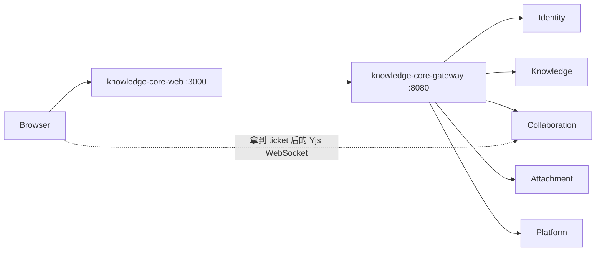

<!-- Generated by Skill Constructor. Edit .skill-constructor/manifest.json through the CLI. -->

# Knowledge-Core-Web: 服务

浏览器只与同源的 Knowledge-Core-Web 通信。BFF 通过 `/api/auth/*` 做认证，并通过 `/api/gateway/[...path]` 代理 Gateway HTTP。knowledge-core-web 依赖 knowledge-core-gateway，不直接调用 Identity、Knowledge、Collaboration、Attachment 或 Platform。实时 Yjs 流量是浏览器到 Collaboration 的路径（Knowledge 签发短时 ticket 之后）；Web 进程不持久化 CRDT 更新。

<!-- fact:services.relationships status:verified sources:docs/technical-plan.md -->

### knowledge-core-web

- **apis**: `/{locale}` 下的 App Router 页面；BFF `/api/auth/*`、`/api/gateway/[...path]`、`/api/health`
- **data**: 无；没有领域 schema
- **dependencies**: knowledge-core-gateway
- **doesNotOwn**: PostgreSQL、Redis、NATS、MinIO/S3、Yjs 持久化、Gateway 路由或集群网络策略
- **health**: /api/health
- **language**: TypeScript
- **ports**: {"http":3000}
- **role**: Next.js UI 与同源 BFF

<!-- fact:services.catalog status:verified sources:deploy/web/base/deployment.yaml, user-confirmed -->

## 附录

## `entrypoints.catalog`

状态：`verified`

本地开发是 `pnpm dev`。生产通过端口 3000 上的 `.next/standalone/server.js` 提供服务。进程健康检查是 `/api/health`。部署冒烟是 `scripts/smoke.sh`。Kubernetes 打包在 `deploy/web`，当前 overlay 是 `deploy/web/overlay/dev`。

来源： `user-confirmed`
